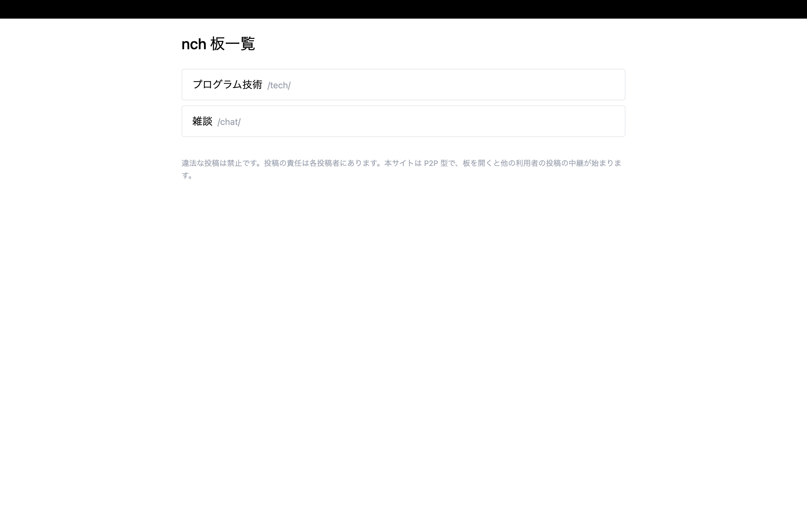
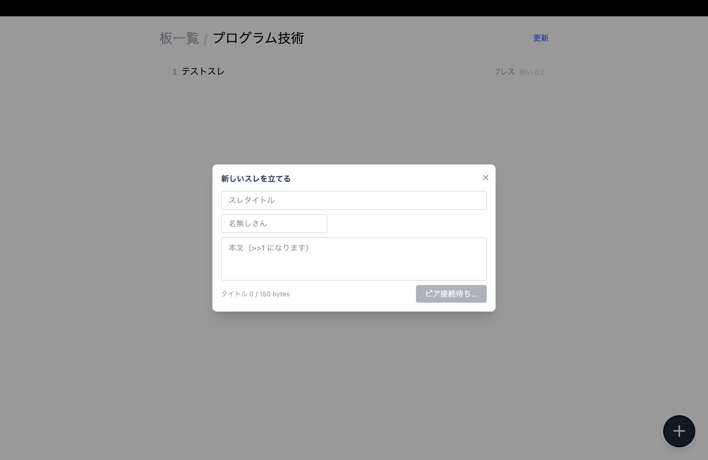

# nch

ブラウザ完結のp2p bbs

**Demo**: [nch](https://nch-core.onrender.com/)
※IPv6環境でのアクセスを推奨
※無料インスタンスを使っているため最大60秒ほどコールドスタートが起こることがあります
※p2pシステムのため、同時に接続しているピアがいない場合データの同期が起こらず空表示となります





## 仕組み

- **ゴシッププロトコル** — 投稿はピア間でリレーされネットワーク全体に伝播する
- **差分同期** — 参加時にピアとダイジェストを交換し、過去ログの差分だけを取得する（eventual consistency）
- **WebRTC DataChannel** — ブラウザ間で直接通信。ポート開放不要
- **コンテンツハッシュ + Ed25519 署名** — 投稿の改竄を検知
- **シグナリングサーバー** — 最初のピアを紹介するブートストラップ。接続後のピア発見はゴシップ経由。誰でも立てられる

## 既知の制限

- IPv6 のみ対応（IPv4 は NAT 環境によっては接続不可）
- TURN サーバーは使用しない。直接接続できないピア同士は通信できない
- 中央管理者が存在しないため、モデレーションの仕組みは未解決の課題として残っている

## 免責

投稿の責任は各投稿者に帰属します。シグナリングサーバーは投稿内容を中継していません。中央集権的なサービス提供者が存在しないp2p型のツールであることを理解して使用してください。ブラウザを開くと投稿内容の中継が始まります。
p2p化は技術デモが目的であり、違法な投稿を許容することは目的ではありません。

## ステータス

MVP 開発中

## Tech Stack

TypeScript / React / Vite / Tailwind CSS / WebRTC / Vitest / Biome

## Getting Started

```bash
git clone https://github.com/p2pbbs/p2pbbs.git
cd p2pbbs
npm install
npm run signaling:dev
npm run dev
```

ブラウザで <http://localhost:5173> を2つのタブで開くと、投稿が伝播する様子を確認できます。

## Development

```bash
npm test        # 単体テスト（Vitest）
npm run lint    # Biome
```

AI実装の規約・テスト戦略は `.claude/skills/` 配下に定義しています。
ドメイン言語は`CLAUDE.md`に定義しています。

## License

AGPL-3.0
