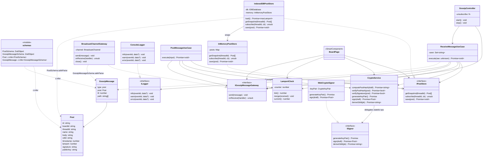

# nch クラス図

```mermaid
classDiagram
    direction TB

    %% ─── Domain: Models (derived from schemas) ───
    class schemas {
        <<module>>
        PostSchema: ZodObject
        GossipMessageSchema: ZodObject
        Post: z.infer~PostSchema~
        GossipMessage: z.infer~GossipMessageSchema~
    }

    class Post {
        id: string
        boardId: string
        threadId: string
        name: string
        body: string
        odId: string
        timestamp: number
        lamport: number
        signature: string
        publicKey: string
    }

    class GossipMessage {
        type: post
        post: Post
        ttl: number
        path: string[]
    }

    schemas ..> Post : z.infer
    schemas ..> GossipMessage : z.infer
    GossipMessage --> Post

    %% ─── Domain: Ports ───
    class IPostStore {
        <<interface>>
        getSnapshot(threadId) Post[]
        subscribe(threadId, cb) unsub
        save(post) Promise~void~
    }

    class IGossipMessageGateway {
        <<interface>>
        send(message) void
        onReceive(handler) unsub
    }

    class ISigner {
        <<interface>>
        generateKeyPair() Promise
        sign(draft) Promise~Post~
        deriveOdId(pk) Promise~string~
    }

    class ILogger {
        <<interface>>
        info(eventId, data?) void
        warn(eventId, data?) void
        error(eventId, data?) void
    }

    %% ─── Domain: Services ───
    class CryptoService {
        computePostHash(draft) Promise~string~
        verifyPostHash(post) Promise~bool~
        verifySignature(post) Promise~bool~
        generateKeyPair() Promise
        sign(draft) Promise~Post~
        deriveOdId(pk) Promise~string~
    }

    class LamportClock {
        -counter: number
        tick() number
        merge(received) void
        current() number
    }

    CryptoService --> ISigner : delegates stateful ops

    %% ─── Adapter: Crypto ───
    class WebCryptoSigner {
        -keyPair: CryptoKeyPair
        generateKeyPair() Promise
        sign(draft) Promise~Post~
    }

    WebCryptoSigner ..|> ISigner

    %% ─── Adapter: Storage ───
    class InMemoryPostStore {
        -posts: Map
        getSnapshot(threadId) Post[]
        subscribe(threadId, cb) unsub
        save(post) Promise~void~
    }

    class IndexedDBPostStore {
        -db: IDBDatabase
        -memory: InMemoryPostStore
        load() Promise~maxLamport~
        getSnapshot(threadId) Post[]
        subscribe(threadId, cb) unsub
        save(post) Promise~void~
    }

    InMemoryPostStore ..|> IPostStore
    IndexedDBPostStore ..|> IPostStore
    IndexedDBPostStore --> InMemoryPostStore : wraps
    IndexedDBPostStore ..> Post : PostSchema.safeParse

    %% ─── Adapter: Gossip ───
    class BroadcastChannelGateway {
        -channel: BroadcastChannel
        send(message) void
        onReceive(handler) unsub
        close() void
    }

    BroadcastChannelGateway ..|> IGossipMessageGateway
    BroadcastChannelGateway ..> GossipMessage : GossipMessageSchema.safeParse

    %% ─── Adapter: Logging ───
    class ConsoleLogger {
        info(eventId, data?) void
        warn(eventId, data?) void
        error(eventId, data?) void
    }

    ConsoleLogger ..|> ILogger

    %% ─── UseCase ───
    class PostMessageUseCase {
        execute(input) Promise~void~
    }

    class ReceiveMessageUseCase {
        -seen: Set~string~
        execute(raw: unknown) Promise~void~
    }

    PostMessageUseCase --> IPostStore
    PostMessageUseCase --> CryptoService
    PostMessageUseCase --> LamportClock
    PostMessageUseCase --> IGossipMessageGateway

    ReceiveMessageUseCase --> IPostStore
    ReceiveMessageUseCase --> CryptoService
    ReceiveMessageUseCase --> LamportClock
    ReceiveMessageUseCase --> IGossipMessageGateway
    ReceiveMessageUseCase --> ILogger
    ReceiveMessageUseCase ..> GossipMessage : GossipMessageSchema.safeParse

    %% ─── Controller ───
    class GossipController {
        -unsubscribe: fn
        start() void
        stop() void
    }

    GossipController --> IGossipMessageGateway
    GossipController --> ReceiveMessageUseCase

    %% ─── UI ───
    class BoardPage {
        <<SmartComponent>>
    }

    BoardPage --> IPostStore
    BoardPage --> CryptoService
    BoardPage --> LamportClock
    BoardPage --> IGossipMessageGateway
```
